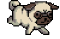
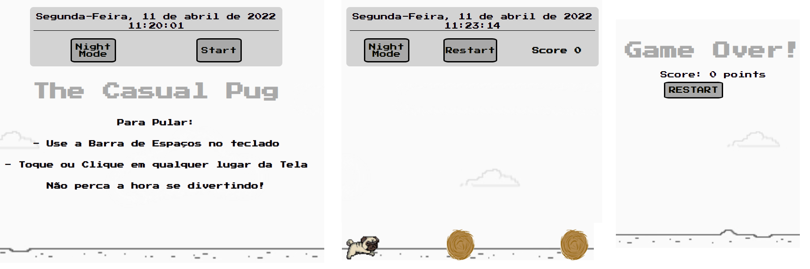

### Refatorando, personalizando e implementando a responsividade no Jogo do Dinossauro do Chrome sem internet.

# The Casual Pug Game

### Projeto "Recriando o famoso jogo do dinossauro sem internet"
### Bootcamp "Philips Fullstack Developer | You Are You"
### Digital Innovation One

## SITE TOTALMENTE RESPONSIVO

Refatorando, personalizando e implementando a responsividade total no projeto ["Recriando o famoso jogo do dinossauro sem internet"](https://web.dio.me/project/recriando-o-famoso-jogo-do-dinossauro-sem-internet/learning/6e0ce884-2c7c-4d61-b2a4-28a0d48d279a?back=/track/philips-fullstack-developer&tab=undefined) do Bootcamp ["Philips Fullstack Developer | You Are You"](https://web.dio.me/track/5c0a81e0-3566-4314-8075-298147b2858d) da DIO.

O projeto original foi refatorado e personalizado assim como implementadas a responsividade total e outras funcionalidades como relógio e data, pois jogos casuais costumam distrair mais do que o necessário. Também foram corrigidos problemas de movimentação, limpeza, ordenação e organização das classes no css, do script e das tags html para melhor apresentação do código, assim como foram acrescentados comentários em cada elemento com uma breve descrição de sua função no script e no css com a mesma finalidade.

 PODE SER UTILIZADO EM SMARTPHONES NÃO IMPORTA A ORIENTAÇÃO.

Sites ferramentas:
- [icon archive](https://iconarchive.com/) "favicon"
- [google fonts](fonts.google.com) "fontes online"
- [netlify](netlify.com) "hospedagem gratuita do site"
- [dio](web.dio.me) "aprendizado"
- [google](google.com) "pesquisa"
- [stackoverflow](https://pt.stackoverflow.com/) "pesquisa"
- [online image editor](https://www.online-image-editor.com/?language=portuguese) "edição das imagens"
- [gifer](https://gifer.com/pt) "imagens .gif"

Site Hospedado do Projeto Personalizado: [The Casual Pug Game](https://sk8dinogame2.netlify.app/)

[RASCUNHO DO PROJETO](https://github.com/CHCLopes/DinoGame)